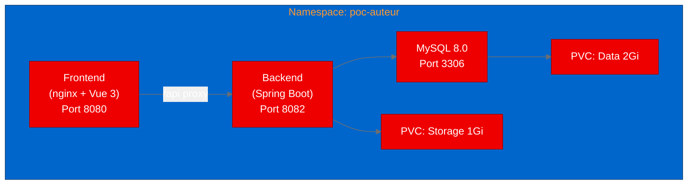

## Deploying an AI video production platform on Red Hat OpenShift

Building an AI-powered content production pipeline is one thing. Operating it on shared infrastructure where teams can access it reliably is another. Auteur is an open source project that combines 16 AI agent roles into an automated video production workflow: scriptwriting, storyboarding, image generation, voice synthesis, and final compositing. We deployed it on Red Hat OpenShift to validate whether a multi-component Java and Vue application with AI agent architecture runs cleanly on the platform.

## What is Auteur?

Auteur is a full-stack application built with Spring Boot 3.3 (Java 21) on the backend and Vue 3 on the frontend. Given a topic, it orchestrates a pipeline of AI agents that handle brainstorming, screenwriting, fact-checking, storyboarding, image generation, text-to-speech, music selection, and video compositing via ffmpeg. The result is a finished MP4 video produced without manual editing.

The architecture is straightforward: a Spring Boot REST API with 24 controllers, a MySQL 8.0 database with Flyway-managed migrations, and a Vue 3 single-page application served by nginx. All AI inference is offloaded to external large language model (LLM) API providers configured at runtime through the web user interface.

## Containerizing for Red Hat OpenShift

Auteur already ships production-quality Dockerfiles, but they use upstream base images. We adapted them to Red Hat Universal Base Images (UBI) for OpenShift compatibility:

**Backend:** Multi-stage build using Maven 3.9 with Eclipse Temurin 21 for compilation, then UBI 9 OpenJDK 21 Runtime for the production image. The key challenge was package management: the UBI OpenJDK runtime image uses microdnf instead of dnf, and installing the EPEL repository required using rpm directly rather than through the package manager.

```dockerfile
FROM docker.io/library/maven:3.9-eclipse-temurin-21 AS build
# ... Maven build stage ...

FROM registry.access.redhat.com/ubi9/openjdk-21-runtime
USER 0
RUN rpm -ivh https://dl.fedoraproject.org/pub/epel/epel-release-latest-9.noarch.rpm || true && \
    microdnf install -y --nodocs ffmpeg-free || true && \
    microdnf clean all
COPY --from=build /workspace/target/app.jar /opt/app-root/src/app.jar
USER 1001
ENTRYPOINT ["sh", "-c", "exec java $JAVA_OPTS -jar /opt/app-root/src/app.jar"]
```

**Frontend:** Multi-stage build with Node 20 Alpine for the Vue/Vite build, then UBI 9 nginx for serving. The nginx configuration required careful path handling: UBI nginx includes server blocks from a specific directory, and port 80 had to be changed to 8080 for OpenShift's non-root security model.

## Deploying the 3-service stack

The deployment consists of 3 services, each with its own Deployment and ClusterIP Service:



The backend connects to MySQL using Spring profiles and Flyway handles schema migration automatically at startup. The frontend nginx proxies API requests under /api/ to the backend service using Kubernetes DNS resolution.

## Test results

| Test | Result | Details |
|---|---|---|
| Backend health | Pass | Spring Boot Actuator returns {"status":"UP"} |
| Frontend load | Pass | Vue 3 SPA loads with all assets |
| API proxy | Fail | Path mismatch: actuator endpoint is not under /api prefix |

The API proxy failure is a path configuration issue, not a deployment problem. The nginx proxy correctly forwards requests to the backend, but the specific test path (/api/actuator/health) does not exist because Spring Boot Actuator is mounted at /actuator/health without the /api prefix.

## What we learned

Auteur's existing Docker Compose setup translated well to Kubernetes. The main adaptation work was switching to UBI base images and handling the differences in package managers and nginx configuration between upstream and UBI images.

The microdnf versus dnf distinction caught us on the first build attempt. UBI's openjdk-21-runtime image is a minimal image that uses microdnf, while full UBI images use dnf. This is a common containerization friction point that is worth documenting.

Resource scheduling required attention on a shared cluster. The 3-service stack needed careful CPU request tuning to fit within available capacity alongside other workloads.

## Try it yourself

The deployment artifacts are in the [aicatalyst-team/Auteur](https://github.com/aicatalyst-team/Auteur) repository on the autopoc-artifacts branch. You will find UBI Dockerfiles, Kubernetes manifests, and the validation test script.

After deployment, configure an LLM API endpoint through the Settings page in the web interface to enable the AI video production features. For more on deploying AI workloads, see the [Red Hat OpenShift AI documentation](https://docs.redhat.com/en/documentation/red_hat_openshift_ai/).
