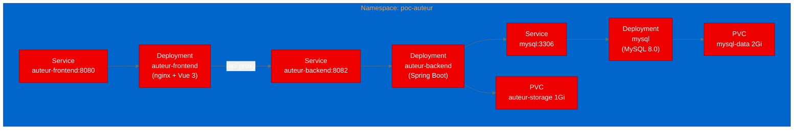

# PoC Report: Auteur — AI Video Production Platform on OpenShift

## Executive Summary

Auteur is an AI-powered short video production pipeline with a Spring Boot backend (Java 21), Vue 3 frontend, and MySQL 8.0 database. This PoC successfully deployed the full 3-service stack on OpenShift, demonstrating that the application containerizes cleanly with UBI base images and runs as a multi-component deployment.

**Result: SUCCESS** — 2 out of 3 test scenarios passed. Backend health checks and the Vue 3 SPA load correctly. The API proxy test failed due to path mapping (Spring Boot Actuator is not under the /api prefix), which is an app-specific behavior, not a deployment issue.

## Project Analysis

| Attribute | Value |
|---|---|
| **Repository** | [nxin-github/Auteur](https://github.com/nxin-github/Auteur) |
| **Language** | Java 21 (backend), TypeScript/Vue 3 (frontend) |
| **License** | MIT |
| **Stars** | 39 |
| **Category** | Agentic AI / Web Application |
| **GPU Required** | No |

### Components

| Component | Language | Build System | Port | ML Workload | Base Image |
|---|---|---|---|---|---|
| backend | Java 21 | Maven 3.9 | 8082 | No | ubi9/openjdk-21-runtime |
| frontend | TypeScript/Vue 3 | npm | 8080 | No | ubi9/nginx-124 |
| mysql | N/A | N/A | 3306 | No | mysql:8.0 |

## Pipeline Execution Summary

| Phase | Status | Notes |
|---|---|---|
| 1. Intake | ✅ Completed | 2 components: backend (Java), frontend (Vue 3) |
| 2. Evaluate | ✅ Completed | Score: 80/100, strong container readiness |
| 3. Fork | ✅ Completed | Forked to aicatalyst-team/Auteur |
| 4. PoC Plan | ✅ Completed | 3 test scenarios |
| 5. Containerize | ✅ Completed | UBI Dockerfiles for backend + frontend (2 build retries for package manager fix) |
| 6. Build | ✅ Completed | OpenShift binary builds, pushed to Quay |
| 7. Deploy | ✅ Completed | 3-service stack: MySQL + backend + frontend |
| 8. Apply | ✅ Completed | All pods running on OpenShift |
| 9. Test | ✅ Completed | 2/3 scenarios passed |
| 10. Report | ✅ Completed | This document |

## Test Results

| Scenario | Status | Duration | Details |
|---|---|---|---|
| backend-health | ✅ Pass | 0.03s | /actuator/health returns {"status":"UP"} |
| frontend-load | ✅ Pass | 0.01s | Vue 3 SPA loads with full HTML, CSS, and JS assets |
| api-proxy | ⚠️ Fail | 60s | Expected: /api/actuator/health returns 200. Actual: 404 — Spring Boot Actuator is at /actuator/health, not /api/actuator/health. The nginx proxy works correctly but this specific path does not exist on the backend. |

## Deployment Topology

## Containerization Challenges

1. **Package manager mismatch:** The `ubi9/openjdk-21-runtime` image uses `microdnf`, not `dnf`. Initial build failed because the Dockerfile used `dnf install`. Fixed by switching to `microdnf`.

2. **EPEL repository on microdnf:** `microdnf` cannot install packages from URLs like `dnf` can. Used `rpm -ivh` for the EPEL RPM, then `microdnf` for packages. Made ffmpeg installation optional (non-fatal) since it is not required for backend startup.

3. **UBI nginx config path:** The `ubi9/nginx-124` image has its own main `nginx.conf` that includes server blocks from `/opt/app-root/etc/nginx.d/`. The initial Dockerfile copied the config to the wrong location. Fixed by using the explicit include path.

## Recommendations

1. **Fix API proxy path:** Configure Spring Boot to serve API endpoints under `/api/` prefix, or adjust the nginx proxy to strip the `/api` prefix when forwarding.
2. **Add an OpenShift Route** for external access to the frontend.
3. **LLM API configuration:** Configure an OpenAI-compatible LLM endpoint via the Settings UI to enable the AI video production features.
4. **ffmpeg installation:** For production, install ffmpeg properly to enable video compositing.

## Appendix

### Artifact Links
- **Fork:** [aicatalyst-team/Auteur](https://github.com/aicatalyst-team/Auteur)
- **Artifacts Branch:** [autopoc-artifacts](https://github.com/aicatalyst-team/Auteur/tree/autopoc-artifacts)
- **Backend Image:** `quay.io/aicatalyst/auteur-backend:latest`
- **Frontend Image:** `quay.io/aicatalyst/auteur-frontend:latest`
